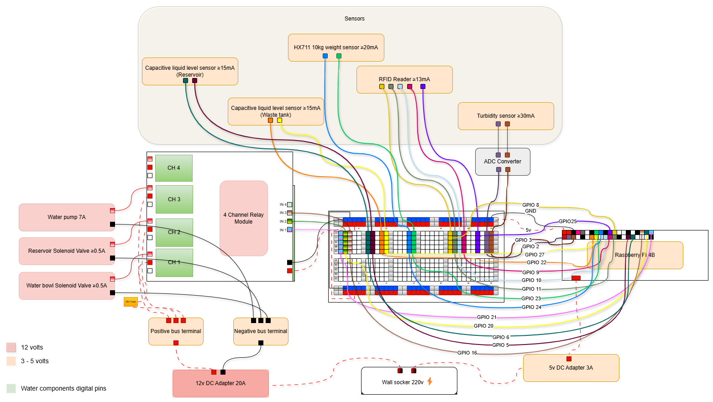

# Smart Water Feeder – Hardware Interface

This is the client program that runs on the Raspberry Pi in the Smart Water Feeder system.

### Deployment Instructions

You can deploy this program in two ways: using the one-click installer (recommended) or by manually deploying it.

#### I. One-Click Installer (Recommended)

1. Clone this project to your Raspberry Pi.
2. Run the installer by executing the command:  
   `bash deploy.sh`
3. Wait for the installation process to complete.
4. Once finished, the program is ready to use.

#### II. Manual Deployment

1. Clone this project to your Raspberry Pi.
2. Update the project path in the `app.service` file.
3. Move the `app.service` file to `/etc/systemd/system/`.
4. Install the required dependencies by running:  
   `pip install -r requirements.txt`  
   _(some systems may require `--break-system-packages`)_.
5. Reload the systemd daemon with the command:  
   `sudo systemctl daemon-reload`
6. Start the application with:  
   `sudo systemctl start app`

### Circuit Diagram

The system's circuit diagram is shown below:

If you encounter any issues, feel free to open a discussion or raise a support query.
